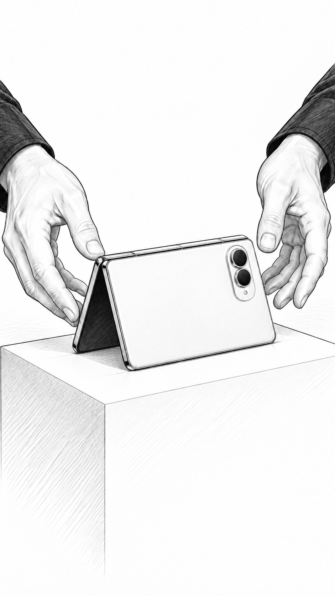
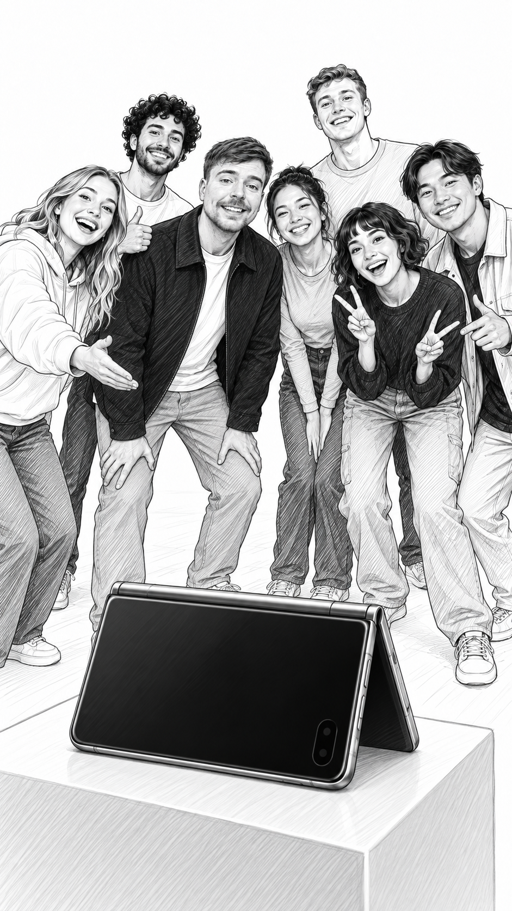

# Brand Partnership Pitch

**Turn a creator channel and a brand brief into shootable scripts, black-and-white storyboards with the actual host, and polished editable documents.**

[中文说明](README.zh-CN.md) · [Install](install.md) · [Skill](skills/brand-partnership-pitch/SKILL.md) · [Security](SECURITY.md) · [License](LICENSE)

**Recommended: use Codex with built-in imagegen.** No separate image-generation API key is needed for that path. Other agents must provide a reference-image-capable image tool or connect a user-configured third-party image API. This repository does not automatically supply image generation, and has **no OpenRouter dependency**.


Despite the repository name, this skill produces branded video concepts and production scripts, not outreach emails or contract negotiations.

## See it in action: MrBeast × iPhone Duo

**One channel + one product brief → three scripts, six storyboard frames and a compact single-column editable script document.**

> **Unofficial concept ad — not a real collaboration or endorsement.** The scenario, dialogue, participants and prize are fictional. Product information comes from Apple; the host's appearance is referenced from actual TikTok video frames.

| The offer | The product solves the problem | Everybody makes the photo |
| --- | --- | --- |
|  |  |  |

**[View the full demo and all six scenes](examples/mrbeast-iphone-duo/README.md)** · **[Read the PDF](examples/mrbeast-iphone-duo/script.pdf)** · **[Download Word](examples/mrbeast-iphone-duo/script.docx)** · [Two other scripts](examples/mrbeast-iphone-duo/alternatives.md)

The selected 40-second concept, *Everybody in the photo*, turns a group-photo giveaway into a demonstration of hands-free capture. The demo includes the real document pages, timestamped source notes and generation details.

## What you get

- Three distinct, complete scripts matched to observed creator formats, voice and production resources.
- Brand/style review, production difficulty, safety notes and a ranked recommendation. Review provenance stays explicit; separate passes are not presented as independent-model consensus.
- **Black-and-white hand-drawn storyboards using actual frames from the original creator videos as image references.** Text descriptions supplement the images; they do not replace them.
- Compact single-column Word/PDF, responsive HTML and copyable text, with complete dialogue and scene directions. Full briefs, review and sources remain in companion production notes; `--include-notes` appends them to the document.
- Scene-specific revisions, independent visual/audio locks, version snapshots and restore. Dialogue-only edits reuse valid images; changed visuals invalidate affected storyboards.

By default, every scene in the selected/recommended script is illustrated. The other two complete scripts are clearly marked as text-only until selected. You can request all alternatives illustrated or only one script. Scene count and duration follow the brief rather than a fixed template.

## Install in Codex

Ask Codex:

```text
Install this plugin: https://github.com/kouzt123/brand-partnership-pitch
```

Or use the CLI:

```bash
codex plugin marketplace add kouzt123/brand-partnership-pitch
codex plugin add brand-partnership-pitch@brand-partnership-pitch-marketplace
```

Start a new task or refresh Codex after installation. The invocation name is **`$brand-partnership-pitch`**. See [installation](install.md) for dependencies and the standalone-skill option.

## Use it

```text
Use $brand-partnership-pitch with https://www.youtube.com/@CREATOR.
Here is the brand brief: [paste the requirement or attach the document].
Write three distinct 60-second scripts, recommend one, and illustrate its
full storyboard with the actual host. Deliver editable Word and PDF.
```

```text
Use $brand-partnership-pitch with these local reference videos and this brief.
Create a full 8-minute integration, including the organic sections and exact
spoken dialogue. Preserve the creator's usual format and sponsor transition.
```

```text
Revise scene 2's dialogue to make the product reveal faster.
Keep its approved visual locked and leave scene 1 entirely unchanged.
```

Inputs can include YouTube, TikTok or Instagram channel URLs, local videos, text, PDF, DOCX, PPTX and reference images. Missing product facts remain unknown; the skill does not invent personal endorsements or results.

## How the workflow runs

1. Interpret the brand requirement: product features, objective, audience, tone, acceptable formats, real usage and CTA.
2. Acquire a bounded sample of channel videos; inspect timestamped frames and subtitles/transcripts.
3. Build a creator profile and bind clear original-video frames to each visible host/cast member.
4. Write and review the alternatives, with exact performable lines and shootable actions.
5. Send actual reference images to the generation tool for each relevant scene; inspect identity, monochrome style, action and absence of lettering.
6. Render and visually inspect the documents; keep local evidence and revision history for subsequent edits.

This is an agent skill with deterministic Python helpers. The helpers do not independently reason about video, write scripts or call a text-model API.

## Dependencies and data flow

| Capability | Requirement | Data handling |
| --- | --- | --- |
| Analysis, writing, review | Codex recommended; another capable agent can follow the skill | Uses the selected agent environment |
| Creator acquisition | Apify adapters and `APIFY_API_TOKEN`, or local/imported material | Public channel links sent to Apify when used |
| Media processing | FFmpeg and ffprobe | Local |
| YouTube download | Current yt-dlp on Python 3.10+ | Platform media request; no automatic browser-cookie import |
| Transcription | Existing subtitles or optional faster-whisper | Local; model weights may need downloading |
| Optional cloud transcription | `ELEVENLABS_API_KEY` | Audio sent to ElevenLabs only when selected |
| Storyboard generation | Codex imagegen, or a configured image tool/API with reference-image input | Selected reference frames go to that image provider |
| Documents | Python 3.10+, python-docx, Pillow, pypdf, LibreOffice and Poppler | Local rendering |

Apify is the default acquisition service, not mandatory for user-provided media. ElevenLabs is optional speech-to-text, not video analysis. Keys belong in your local environment or credential store, never in a prompt, source file or output package. Fees and tool availability depend on your providers and environment.

## Other agents and third-party image APIs

Other agents need image viewing, local command execution, file output and **image generation that accepts actual reference images**. A text-to-image-only endpoint cannot reproduce this host-reference workflow.

The `image-plan` helper exports prompts, aspect ratios, local reference paths and source hashes. The agent must supply the actual images through its tool/API's documented input mechanism, save the generated output, and use the same registration and visual-QA workflow. A filename pasted into a prompt does not upload an image.

No universal third-party image client is bundled. Configure a provider explicitly, verify its current image-input API, keep credentials local and set a cost limit. If generation is unavailable, the result remains explicitly text-only/incomplete. Read the [compatibility contract](skills/brand-partnership-pitch/references/agent-compatibility.md).

## Repository and verification

```text
.codex-plugin/plugin.json             Codex plugin metadata
.agents/plugins/marketplace.json      Version-pinned installation source
skills/brand-partnership-pitch/       Self-contained skill and Python helpers
assets/                              Public icon and workflow diagram
scripts/security_check.py            Source/staged release scan
.github/workflows/check.yml           Offline checks without API secrets
```

```bash
python -m pip install -r skills/brand-partnership-pitch/requirements.txt
python -m unittest discover -s skills/brand-partnership-pitch/tests -v
python scripts/security_check.py
python skills/brand-partnership-pitch/scripts/brand_pitch.py doctor
```

The current workflow passes 42 behavioral tests and live platform/transcription canaries. The current layout is also checked with illustrated and long-dialogue fixtures. See [validation details and limits](skills/brand-partnership-pitch/references/validation.md). Tests do not guarantee access to every protected video or all future provider versions. Local faster-whisper model inference has not been live-tested in the recorded acceptance run.

Fictional structural fixtures and the explicitly published concept demo are distributed. Real-person source frames, downloaded media, live API datasets, private briefs and private acceptance artifacts are excluded. The MIT code license does not grant rights to third-party creator media. The bundled CJK font retains its [OFL license](skills/brand-partnership-pitch/assets/fonts/OFL.txt).
