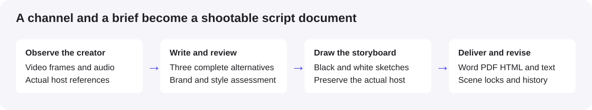

# Brand Partnership Pitch

**输入创作者频道和品牌需求，生成可直接拍摄的脚本、保留真实主播形象的黑白手绘分镜，以及可编辑文档。**

[English](README.md) · [安装说明](install.md) · [Skill](skills/brand-partnership-pitch/SKILL.md) · [安全说明](SECURITY.md)

**推荐使用带有内置 imagegen 的 Codex。** 这条路径无需额外图片 API Key。使用其他 agent 时，必须具备接受参考图片的生图工具，或自行配置支持图片输入的第三方生图 API。安装这个 skill 本身不会带来生图能力。**没有 OpenRouter 依赖，也不要求独立文本模型 API。**



虽然仓库名包含 Pitch，它的实际产出是品牌视频创意和拍摄脚本，不是商务邀约邮件或合同谈判文案。

## 能力

- 三套不同创意的完整脚本，匹配实际观察到的频道形式、表达和制作条件。
- 风格与品牌匹配评分、制作难度、品牌安全评语和推荐排序，明确记录审稿来源，不把同一 agent 的两次复核说成独立模型共识。
- **默认黑白手绘分镜，将原视频中的主播图片真正传入生图工具。** 文字描述作为补充，不用虚构人物替代原主播。
- 可编辑 Word、由同一 Word 生成的 PDF、带内嵌图片的 HTML 阅读版和纯文本；包含时间码、画面调度、完整台词与拍摄备注。
- 逐镜头修改，画面和台词分别锁定，历史快照与恢复。只改台词可复用分镜，视觉变化会使相关旧图失效。

默认三套完整方案，推荐方案每场配图，其余方案明确为文字备选；选择后可继续生成完整分镜。也可以要求全部配图或只写一套。镜头数和时长按真实需求安排，长视频植入会写完自然内容部分。

## 安装到 Codex

直接告诉 Codex：

```text
帮我安装这个 plugin：https://github.com/kouzt123/brand-partnership-pitch
```

也可以运行：

```bash
codex plugin marketplace add kouzt123/brand-partnership-pitch
codex plugin add brand-partnership-pitch@brand-partnership-pitch-marketplace
```

安装后开启新任务或刷新 Codex。调用名称统一为 **`$brand-partnership-pitch`**。

## 使用示例

```text
使用 $brand-partnership-pitch，分析 https://www.youtube.com/@频道。
根据附件中的品牌 brief，写三套不同角度的 60 秒脚本，推荐一套。
分镜用原视频里的主播图片作为参考，生成黑白手绘风格。
交付可编辑 Word 和 PDF。
```

```text
参考这些本地视频，为品牌写一期 8 分钟的视频植入。
自然内容和广告部分都要有完整台词，保持频道原有结构。
```

```text
第二场的产品揭示再快一点，只改台词，锁定画面。
第一场已经通过，保持完全不变。
```

支持 YouTube、TikTok、Instagram 频道、本地视频，以及文字、PDF、DOCX、PPTX 和图片 brief。先理解需求和视频证据，再写作、审稿、生图、排版和逐页检查。缺失产品信息会如实保留，不编造使用经历或效果。

## 依赖和费用

| 能力 | 依赖 |
| --- | --- |
| 理解、写作、审稿 | 推荐 Codex；其他具备对应能力的 agent 也可执行 |
| 频道抓取 | 默认 Apify，需要自己的 `APIFY_API_TOKEN`；本地视频或已有数据不需要 |
| 视频处理 | 本地 FFmpeg / ffprobe；YouTube 下载使用当前版本 yt-dlp 和 Python 3.10+ |
| 转写 | 现有字幕或可选 faster-whisper；ElevenLabs 为可选云转写，需要自己的 `ELEVENLABS_API_KEY` |
| 分镜 | Codex 内置 imagegen；或自己配置支持参考图的生图工具/API |
| 文档 | Python、python-docx、Pillow、pypdf、LibreOffice、Poppler |

本地抽帧不等于整个流程完全离线。云转写会向 ElevenLabs 上传音频；生图会向选定图片服务发送参考帧。相关计费遵循当前服务规则。密钥只在本地环境或凭据存储中配置，不要写入仓库、聊天提示词、日志或交付包。

## 其他 agent 怎么用

读取 `skills/brand-partnership-pitch/SKILL.md`，保留该目录中的所有脚本、参考资料和字体。agent 需要本地执行、看图、文件输出能力，并具备以下之一：

1. 原生支持参考图片的生图/编辑工具；
2. 用户明确选择并配置的第三方生图 API，且接口支持真实图片输入。

`image-plan` 只输出每镜头的提示词、比例、参考图片路径和哈希。agent 要按照图片工具或 API 的实际字段上传图片，不能只把文件名放进提示词。本仓库没有内置通吃所有厂商的 API 客户端，也不会自动选择收费服务。

没有兼容生图能力时，可以产出文字脚本，但必须说明分镜未完成。具体输入、费用限制与验收要求见[兼容说明](skills/brand-partnership-pitch/references/agent-compatibility.md)。

## 验证和安全

核心工作流已通过 40 项行为测试，并实际验证三个平台抓取、下载和 ElevenLabs 转写；本次更名发布会再次检查。详见[验收记录](skills/brand-partnership-pitch/references/validation.md)。这些结果不保证所有受限视频都可访问；记录中的本地 faster-whisper 模型推理尚未实测。

发布内容只有源码、说明、公开图标和虚构结构测试素材，不包含用户密钥、真实频道视频、主播原始照片、私人 brief、生产数据或测试运行目录。安全扫描只报告文件与问题类型，不回显命中的密钥。CI 不需要配置任何 API secret。

代码使用 MIT；随包中文字体保留独立 OFL 许可。代码许可证不授予第三方创作者素材的使用权。
