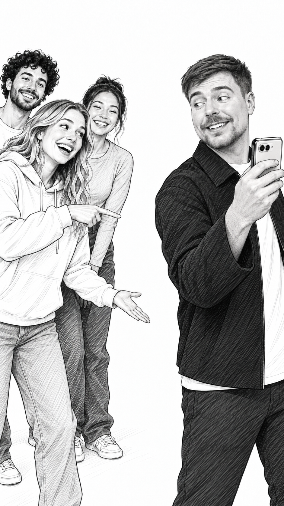
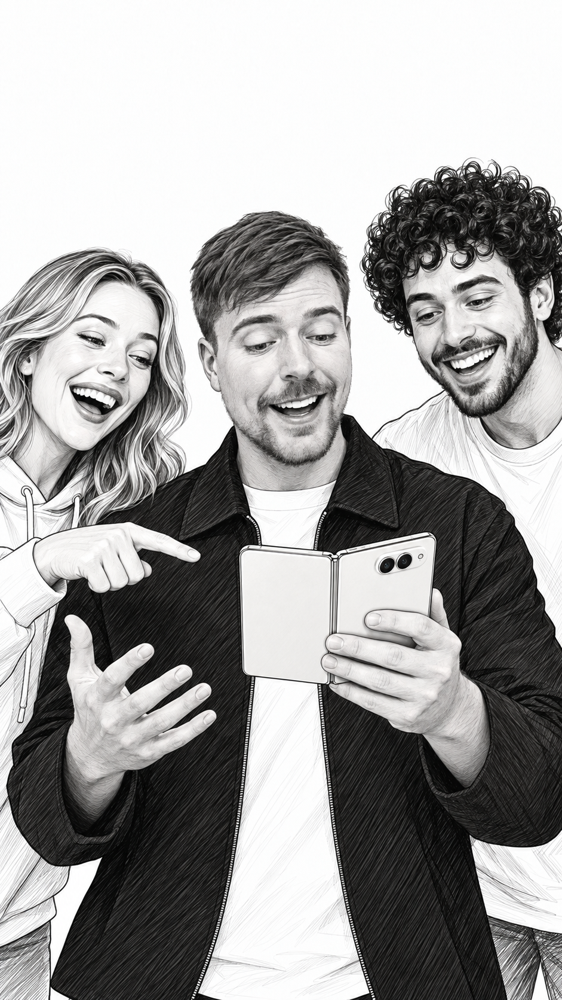
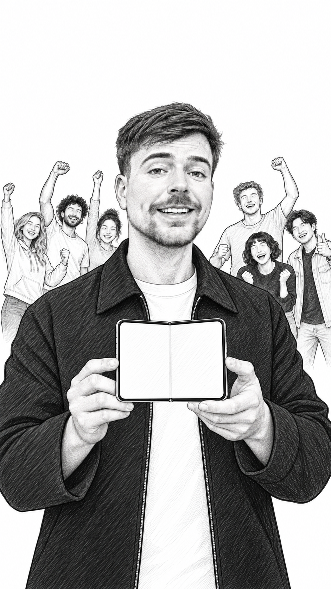
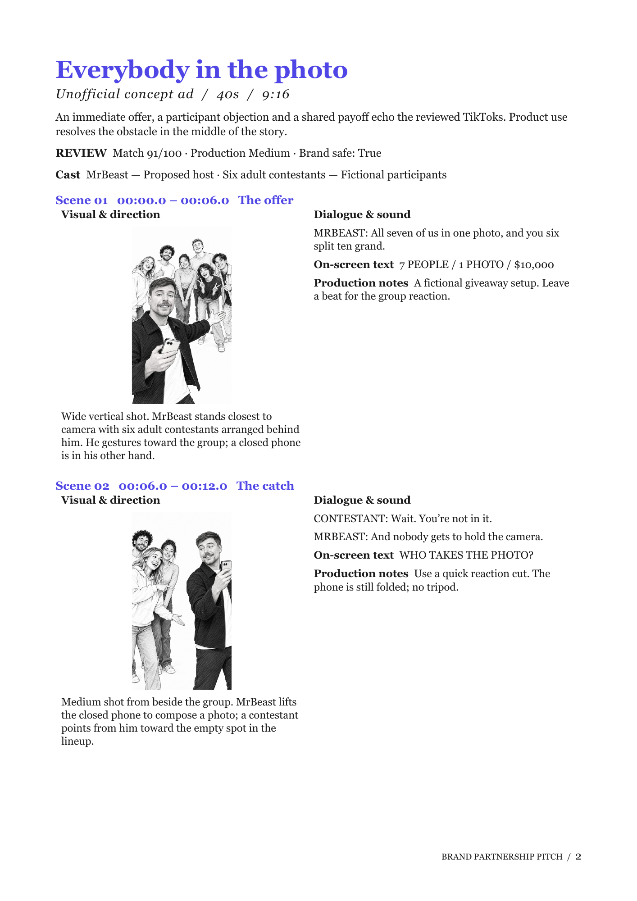
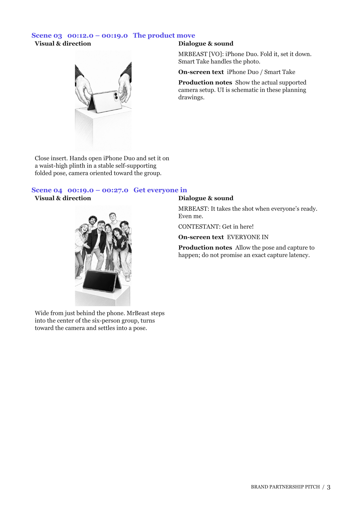

# MrBeast × iPhone Duo

**Everybody in the photo** — a 40-second TikTok concept, from a channel and a brief to a reviewed script, six reference-based storyboards and an editable production document.

> **Unofficial concept ad.** This is an independent demonstration of Brand Partnership Pitch, not a real MrBeast/Apple collaboration or endorsement. Dialogue, participants and the $10,000 prize are fictional.

**[Read the 5-page PDF](script.pdf)** · **[Download editable Word](script.docx)** · [Copy the script](script.md) · [Two complete alternatives](alternatives.md)

## The brief

> Use MrBeast's TikTok channel to develop an iPhone Duo ad. Research the current product, write three distinct concepts, and illustrate the recommended one with the actual host's appearance. Export a script document.

The selected story creates a simple obstacle: everybody must be in the photograph, but somebody is stuck holding the camera. Foldable positioning and Smart Take become the solution. The host can join the group instead of stepping aside for a feature monologue.

## Six scenes from the generated storyboard

| 01 · The offer · 0–6s | 02 · The catch · 6–12s | 03 · The product move · 12–19s |
| --- | --- | --- |
|  |  |  |
| Seven people, one photo. | Who takes the photo? | Fold it. Set it down. |

| 04 · Everyone in · 19–27s | 05 · The payoff · 27–34s | 06 · The close · 34–40s |
| --- | --- | --- |
|  |  |  |
| The host joins the shot. | The group gets the payoff. | Explore iPhone Duo. |

## The actual document output

These are rendered pages from the downloadable DOCX, not recreated mockups. Visual directions and dialogue remain editable. The PDF contains the brief, all six scenes, timecodes, screen copy, production notes, review and source references.

| Script pages 1 and 2 of the scene section | Product use and group payoff setup |
| --- | --- |
|  |  |

## What this demonstrates

| Stage | Actual work performed |
| --- | --- |
| Channel understanding | 12 recent posts sampled; 3 videos reviewed with timestamped frames and existing captions. |
| Brand research | Product claims checked against Apple sources. |
| Creative development | 3 complete scripts; 2 separate Codex review passes. |
| Identity continuity | Actual source frames supplied in every host scene, with previous panels as additional continuity references. |
| Storyboards | 6 selected-route panels; visual inspection and 2 targeted corrections. |
| Documents | Editable DOCX and matching 5-page PDF; all pages rendered and visually inspected. |

The recommendation scored 91/100 under the skill's editorial rubric. This is a subjective creative assessment, not a predicted success rate or independent-model consensus. The other complete routes scored 86 and 85 and remain text-only.

[Sources and observations](sources.md) · [Generation notes](prompts.md) · [Delivery checks](checks.json)

## 中文说明

这是一个**非官方概念广告**：用 MrBeast 的 TikTok 频道和 iPhone Duo 需求，演示从内容分析、三套脚本、真实主播参考生图，到可编辑拍摄文档的全过程，并不表示存在真实合作或代言。

推荐创意「所有人都进照片」把产品用法放进故事：提出合影奖金 → 发现主播缺席 → 摆放折叠手机 → 主播加入合影 → 众人反应 → 产品收尾。上方六张分镜和文档页都来自这次实际生成的输出。原视频画面确实作为图片输入传给了 imagegen；原始视频、参考照片、字幕全文和凭据没有上传。
